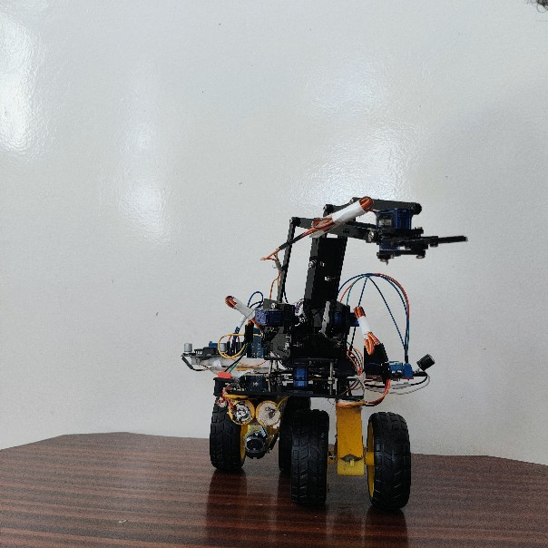
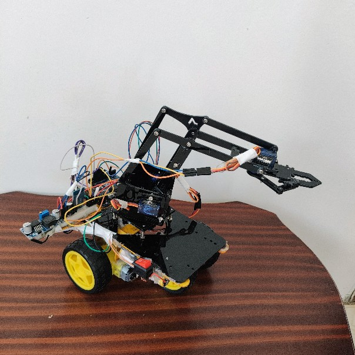
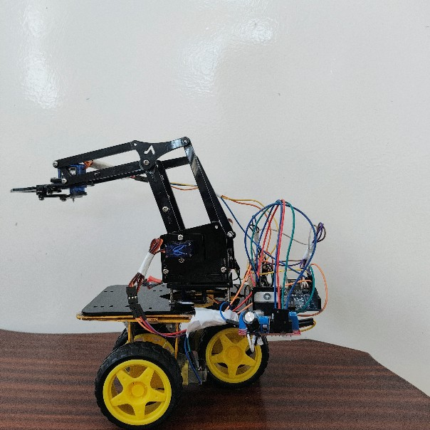
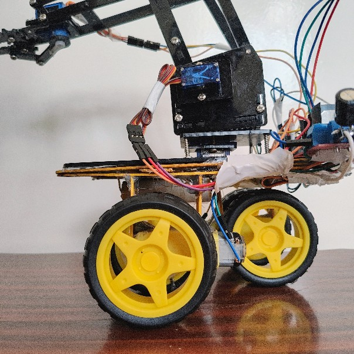
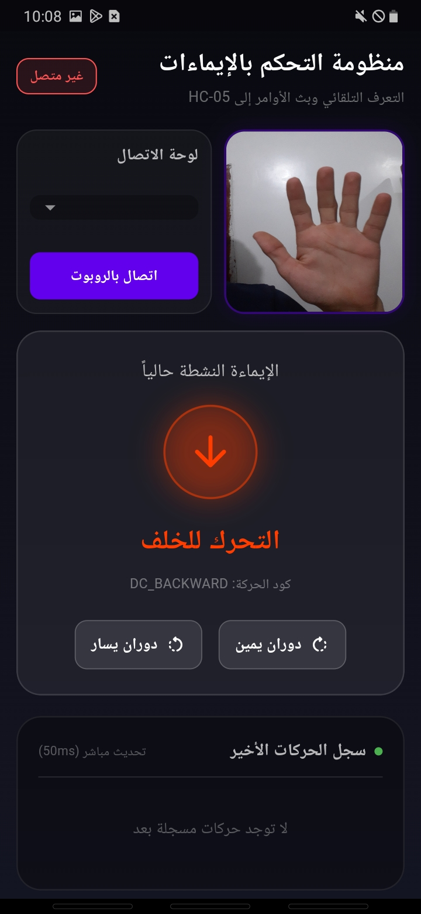
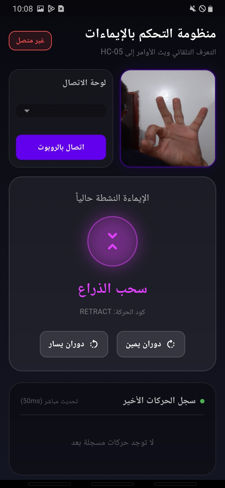
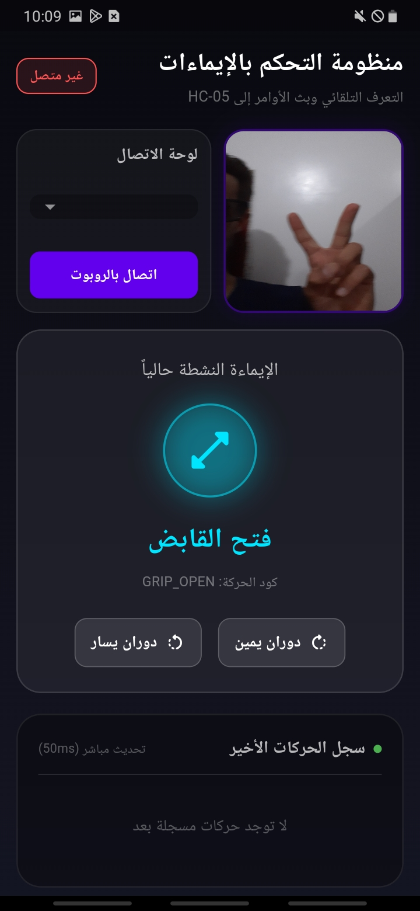

# Robot Hand and Mobile Base Controller: Computer Vision to Physical Actuation

## Project Overview
This repository contains the source code and documentation for a comprehensive cyber-physical system. The project demonstrates the successful integration of real-time Computer Vision (CV) algorithms with embedded electronics to remotely control a differential-drive mobile robot equipped with a 4 Degree-of-Freedom (DOF) robotic arm. The system utilizes a hybrid control approach: primary kinematics are driven by human hand gestures via AI, while specific navigation maneuvers are executed via an intuitive Flutter UI.

## 🎥 Watch the Demo
**See the robot in action!** Watch the full video demonstration of controlling the mobile base and the robotic arm via real-time hand gestures on YouTube:
▶️ **[تحكم بروبوت متحرك وذراع آلية بإيماءات اليد | Hand Gesture Robot Control](https://youtu.be/E1I6UvdjfzE?si=7N_h8rOKjhbLzfZs)**

---

## Visual Showcase

### Hardware Setup

  
  
   
  
  

### Application and Gesture Recognition

  
  
  

## Technical Architecture

The system architecture is strictly divided into three main layers: Perception, Communication, and Actuation.

### 1. Perception Layer (Flutter & MediaPipe)
The frontend is developed using the Flutter framework, ensuring cross-platform compatibility and high-performance camera frame rendering via CameraX. At the core of the perception layer is the Google MediaPipe Hand Landmarker AI model. 
- The deep learning model extracts 21 3D spatial landmarks from the hand in real-time.
- Custom algorithms analyze the Euclidean distances and specific geometric angles between joints to classify the current gesture.
- A state management logic is implemented to prevent signal bouncing, ensuring stable and explicit command generation.

### 2. Communication Layer (Bluetooth Serial)
To maintain a continuous and low-latency data stream, the system utilizes the Classic Bluetooth protocol via the HC-05 module. 
- The Flutter application transmits parsed string commands terminated by a newline character (`\n`).
- The transmission rate and buffer management are optimized to prevent serial buffer overflow on the microcontroller side.

### 3. Actuation Layer (Arduino & Motor Control)
The microcontroller (Arduino UNO) parses the incoming serial data and manages the hardware execution.
- **Mobile Base (Differential Drive):** Utilizes an L298N motor driver connected to analog pins (configured as digital outputs) for direction, and PWM-enabled pins for precise speed control. Dynamic torque adjustment provides higher PWM signals during backward movement to safely overcome mechanical resistance.
- **Robotic Arm:** Controls 4 independent servo motors (Base, Lift, Extend, Grip). To achieve industrial-like smooth motion, the firmware avoids blocking `delay()` functions. Instead, it increments servo angles step-by-step within the main loop state machine, providing fluid kinematic movement.

## Command Mapping Protocol (Hybrid Control)

The system manages 10 distinct movements utilizing a hybrid mapping protocol. Computer vision handles complex 4-DOF kinematics and forward/backward driving, while UI buttons ensure precise lateral tank-turn navigation.

| Target Mechanism | Movement / Action | Input Trigger |
| :--- | :--- | :--- |
| **DC Motors (Chassis)** | Move Forward | **CV:** Closed Fist |
| **DC Motors (Chassis)** | Move Backward | **CV:** Open Hand |
| **DC Motors (Chassis)** | Tank Turn (Right/Left) | **UI:** App On-Screen Buttons |
| **Robotic Arm (Grip)** | Open / Close Claw | **CV:** Pinch Gesture |
| **Robotic Arm (Base)** | Rotate Right / Left | **CV:** [Pointing the index finger to the right or left] |
| **Robotic Arm (Lift)** | Lift Up / Down | **CV:** [Thumb up or thumb down] |
| **Robotic Arm (Extend)**| Extend Forward / Back | **CV:** [Three fingers with or without the index finger] |
| **Entire System** | Emergency Stop (Hold) | **CV:** No Hand Detected |

## Installation and Setup Instructions

### Prerequisites
- Flutter SDK (v3.10.4 or higher)
- Arduino IDE
- Physical Android Device (Emulators do not support the required Bluetooth/Camera hardware APIs)

### Hardware Assembly
1. Connect the HC-05 TX/RX to the Arduino (SoftwareSerial pins 12, 13).
2. Wire the L298N motor driver IN1-IN4 to Arduino pins A0-A3, and ENA/ENB to PWM pins 3 and 5.
3. Connect the 4 Servo motors to pins 10, 11, 4, and 9.
4. Ensure the entire system is powered by an isolated power supply (e.g., 8.4V Li-ion battery pack).

### Software Deployment
1. Clone this repository to your local machine.
2. Navigate to the Arduino directory and flash the firmware to the UNO board.
3. Navigate to the Flutter directory and run `flutter pub get` to fetch dependencies.
4. Build and install the APK on your Android device using `flutter run --release`.
5. Pair the HC-05 module with your smartphone prior to launching the application.

## License
This project is open-source and available for educational, academic, and developmental purposes.
